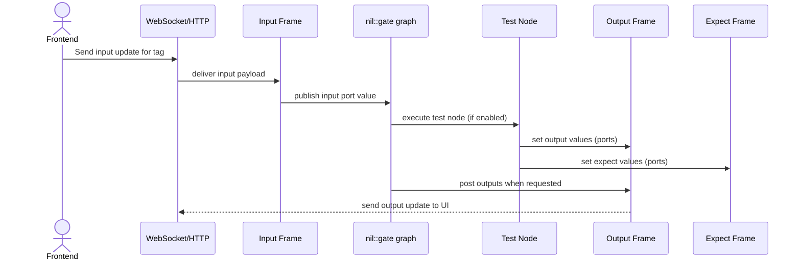
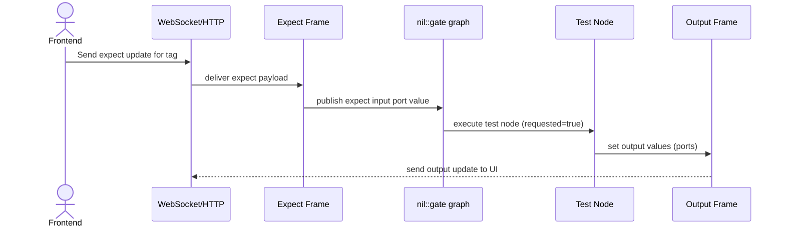
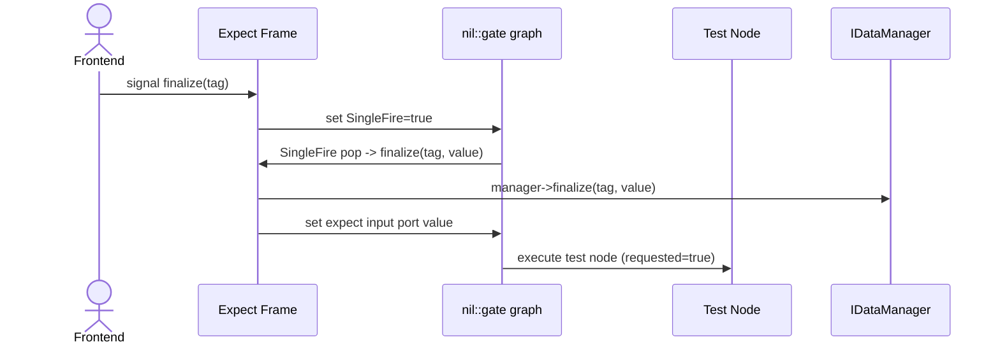

# Repository Context (Auto-Loaded)

This file mirrors the existing assistant summary so Copilot can auto-load repo context.

## Repo reference notes

### Build and Configure
- Configure: ./configure/gcc -tsc
- Build output: .build (Ninja)

### Dependencies and vcpkg
- vcpkg used; deps in .build/vcpkg_installed
- Focus on nil- dependencies; ignore boost/other third-party deps

### Runtime Flows
- Finalize signal: UI triggers finalize(tag) -> SingleFire set -> leaf node finalizes expect with latest output -> expect input update -> test reruns when requested=true

### Entry Points
- Runner/CLI: src/gtest/publish/nil/xit/gtest/main.hpp
- Runtime wiring: src/test/publish/nil/xit/test/App.hpp
- Frame builder: src/gtest/publish/nil/xit/gtest/builders/FrameBuilder.hpp
- Test builder: src/gtest/publish/nil/xit/gtest/builders/TestBuilder.hpp

## What this repository is
This repository provides a test layer for `nil-xit`. It ships a core test library (`xit-test`) plus a GoogleTest integration library (`xit-gtest`) that can run tests headless (GTest) or through a GUI server with WebSocket support. A sandbox target demonstrates how to define frames and tests using the provided macros.

## How it works (from source)
- The main entry point for the runner lives in `nil::xit::gtest::main()` and is wired to a weak `main()` symbol so binaries can use it by default.
- The runner supports two modes:
  - Headless: integrates with GoogleTest, lists tests, runs GTest, and uses a cache manager to preinstall frames.
  - GUI: starts an HTTP server, initializes a `nil::xit::test::App`, installs frames/tests, and serves a UI via WebSocket.
- Tests are declared via macros (for example `XIT_TEST`, `XIT_TEST_F`) that register tests, track groups, and wire inputs/outputs/expect frames at compile time.
- Frames are registered via macros (`XIT_FRAME_*`) that create typed input/output/expect frames. These frames are installed into the runtime app and are used to shuttle data between tests and the UI.
- `nil::xit::test::App` is the runtime host that owns the `nil::xit` core and a `nil::gate` graph. It manages tags, frame registrations, and request/response wiring for test inputs, outputs, and expectations.
- Tags map tests to file/group paths. Group paths are required at runtime to resolve test assets, and missing groups can be treated as errors or ignored depending on CLI flags.

## Key components
- **xit-test** (library): runtime app and frame plumbing for tests.
- **xit-gtest** (library): GTest adapter, CLI, builders, headless cache, and registration macros.
- **sandbox** (optional target): example tests and frames; off by default.

## Build integration notes from code
- The root CMake project depends on `nil-clix`, `nil-xit`, `nil-gate`, and `GTest`.
- The `gtest` subdirectory is built only when `ENABLE_FEATURE_GTEST` is enabled.
- The `sandbox` target is built only when `ENABLE_SANDBOX` is enabled.

## How tests are registered (high-level)
1. A test macro registers a test case and associates it with a group/path tag.
2. Frame macros register input/output/expect frame types used by the test.
3. At runtime, the `App` wires these frames into a `nil::gate` graph.
4. Headless mode runs GTest; GUI mode serves a UI and executes tests through the HTTP/WebSocket runtime.

## Frontend-triggered runtime sequences

### Input frame update (frontend pushes new input)


### Expect frame update (frontend pushes new expect value)


### Expect finalize signal (UI -> library -> test)


Note: the test run in this sequence assumes `requested=true`. The expect input
port update can retrigger the test when `requested` remains true.

## Runtime flow (from source)

### Headless
1. CLI parsing selects headless mode and validates group paths.
2. `nil::xit::gtest::get_instance()` provides the registered builders and group maps.
3. A `headless::CacheManager` is created and all registered frames/tests are installed into it.
4. GTest is initialized and `RUN_ALL_TESTS()` executes the registered XIT tests.
5. Optional listing/verbose output prints available tests and group info.

### GUI
1. CLI parsing selects GUI mode and validates group paths.
2. An HTTP server is created and `nil::xit::setup_server()` registers HTTP/WebSocket routes.
3. A `nil::xit::test::App` is created with a runnable service and event service.
4. The app installs frames, tests, and the main frame; it also registers group paths for asset resolution.
5. The app starts its `nil::gate` graph, then the server runs and the UI can request data or trigger test runs.

### Gate graph wiring (runtime behavior)
1. Each test registers a node via `App::add_node()` that declares its input, output, and expect frame dependencies.
2. For outputs and expects, a gate “enabling node” is created that only allows execution when any output/expect is requested.
3. The test node runs the user test callable, then assigns returned values to output ports and expect ports.
4. Output ports are bridged to frame `post()` callbacks with a rerun tag, so UI updates happen only when requested.
5. Expect ports are bridged through a `SingleFire` flag; values are finalized only once when the UI requests them.
6. On frame subscription, `add_info_on_sub()` initializes input/expect data for the first subscriber and marks “requested” flags inside the gate graph.

## Concepts (quick map)
- **Frame**: Typed input/output/expect channel registered via `XIT_FRAME_*` macros and installed by `FrameBuilder`.
- **Tag**: Unique test identifier built from suite/case + group/path, used to map frames to assets.
- **Group**: Named root path (from `$group/...`) that resolves file-based test assets.
- **Instances**: Global registry holding builders, paths, and the test tracker.
- **Requested**: Boolean gate that enables test execution when a UI subscriber exists.
- **SingleFire**: One-shot flag that allows expect values to finalize once per request.
- **Gate graph**: `nil::gate` nodes/ports wiring inputs, outputs, and expectations.
- **Data<T...>**: Tuple-like adapter exposing frame data as references for tests.

## Key entry points
- Runner entry point + CLI: [src/gtest/publish/nil/xit/gtest/main.hpp](src/gtest/publish/nil/xit/gtest/main.hpp)
- Test registration macros: [src/gtest/publish/nil/xit/gtest/MACROS.hpp](src/gtest/publish/nil/xit/gtest/MACROS.hpp)
- Runtime app wiring: [src/test/publish/nil/xit/test/App.hpp](src/test/publish/nil/xit/test/App.hpp)
- Global registry and builders: [src/gtest/publish/nil/xit/gtest/Instances.hpp](src/gtest/publish/nil/xit/gtest/Instances.hpp)
- Frame builder (inputs/outputs/expects): [src/gtest/publish/nil/xit/gtest/builders/FrameBuilder.hpp](src/gtest/publish/nil/xit/gtest/builders/FrameBuilder.hpp)
- Test builder (group/path expansion): [src/gtest/publish/nil/xit/gtest/builders/TestBuilder.hpp](src/gtest/publish/nil/xit/gtest/builders/TestBuilder.hpp)

## Minimal test recipe
```cpp
struct MyTest
{
  XIT_INPUTS("input_frame");
  XIT_OUTPUTS("output_frame");
  XIT_EXPECTS("expect_frame");
};

XIT_TEST_F(MyTest, demo, "$test/path")
{
  const auto& [in] = xit_inputs;
  auto& [out] = xit_outputs;
  auto& [exp] = xit_expects;
  // mutate out/exp based on in
}
```

If you do not need inputs or expects, omit the corresponding `XIT_INPUTS` or
`XIT_EXPECTS` line and the `xit_inputs`/`xit_expects` binding.

## Runtime toggles
- Headless mode: GTest runner, no HTTP server.
- GUI mode (`gui` subcommand): HTTP + WebSocket UI runtime with test execution.
- `--list`: prints tags resolved from groups (headless or GUI).
- `--path-group`: supplies group name to filesystem path mappings.
- `--ignore-missing-groups`: allows running without all group paths.
